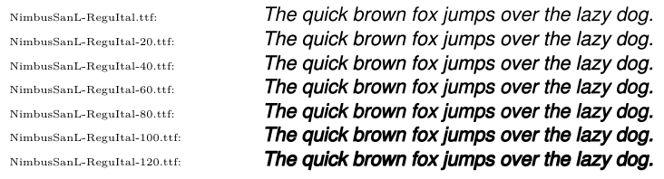

# `make-font-bolder`: a simple script to quickly create various bold variants of a font with various weights

`make-font-bolder` is a small script based on FontForge that can create many bold variations (=weighted) of a given font like:



This is by no mean the cleanest way to generate bold characters (we basically mostly enlarge the path of the shape), but it can give good enough results without too much hassle. To see a demo, check out [./Demo/demo.pdf](./Demo/demo.pdf).

## Usage

To run the script, if you have nix installed, just run:
```
$ nix run github:tobiasBora/make-font-bolder -- --size 30 YourInputFont.ttf YourOutputFont.ttf
```

Otherwise, you make sure to install `fontforge` (you can create a temporarily shell with nix with `nix-shell -p "(python3.withPackages (ps: with ps; [ fontforge ]))"`), and run:
```
./make-font-bolder --size 40 YourInputFont.ttf YourOutputFont.ttf
```

We provide various options to control the process of making it bold or to apply it only on some glyphs, check the documentation with:
```
./make-font-bolder -h
```

